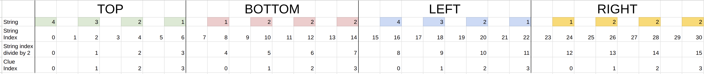

## Description
Skyscraper Puzzle.

## File Structure
```
rush01.h
 - main header file

main.c
 - program main entry point

input_validation.c
 - validate clue input

init.c
 - parse input
 - store clues
 - initialize the grid & pad them with 0

deduction.c
 - apply deterministic rules

solver.c
 - fill up the rest of the grid
 - either through iteration or recursion

validation.c
 - verify whether rows, columns, and clues are valid

utils.c
 - helper functions like ft_putchar, ft_putnbr, etc
```

## Phases
**Stage 1: Parsing**  
　- Accept the input  
　- Validate the input  

**Stage 2: Printing the board**  
　- Create a function to print the board in the terminal for testing  

**Stage 3: Deterministic rules**  
　- Fill up the board with deterministic rules  
　- Save the updated board

**Stage 4: How to fill the rest of board?**  
　- Backtracking  
　- No duplicate rule

**Stage 5: How to validate the board?**  
　- The condition to control the recursrion  
　- Return specific error message when there is no possible combination  

## Solving the Skyscraper Puzzle

### What are the deterministic rules?

#### Single Clue:


#### Double Clue:


### How do we do backtracking to fill up the remaining cells in the board?

## Visualization to Parse Input into Clues Struct

